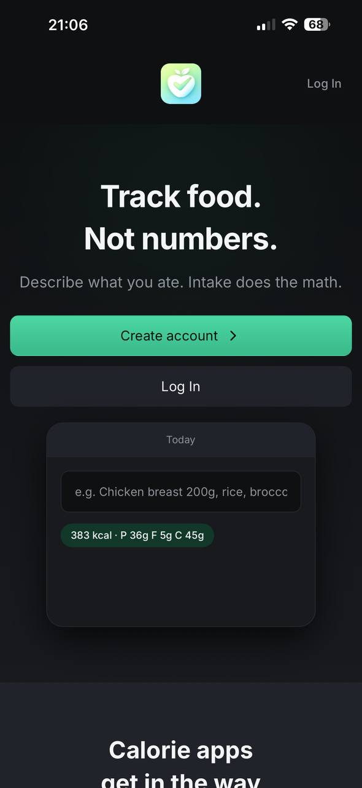
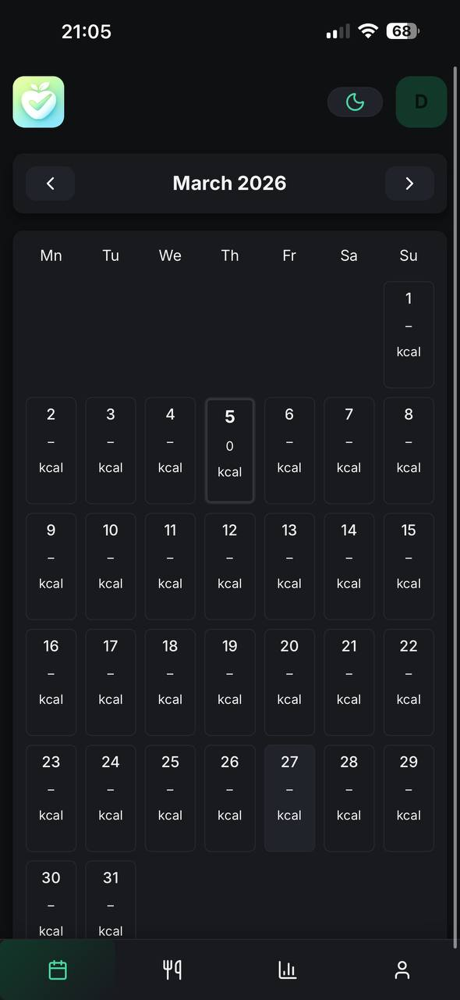
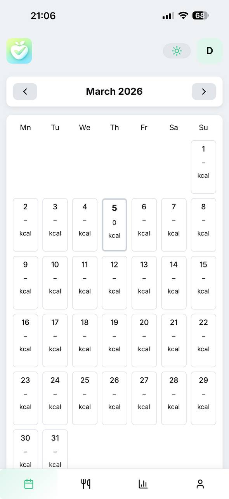
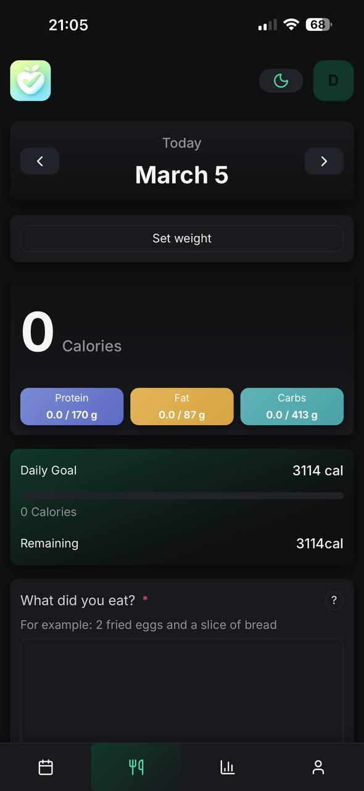
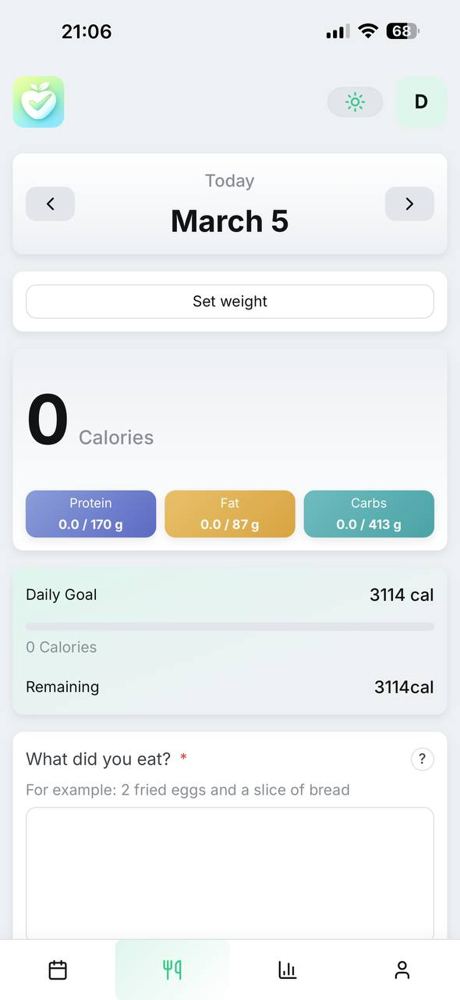
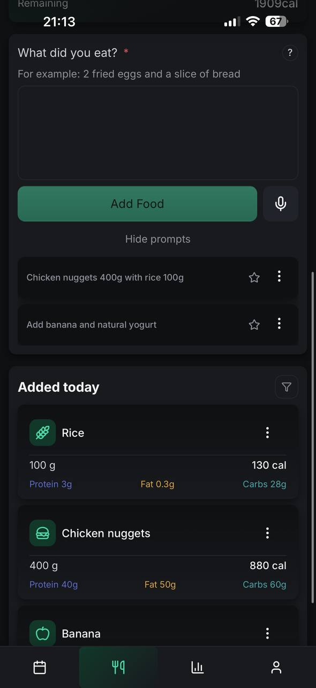
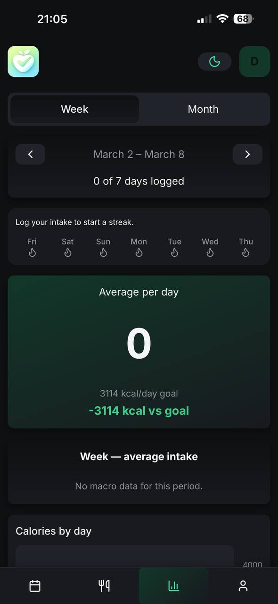
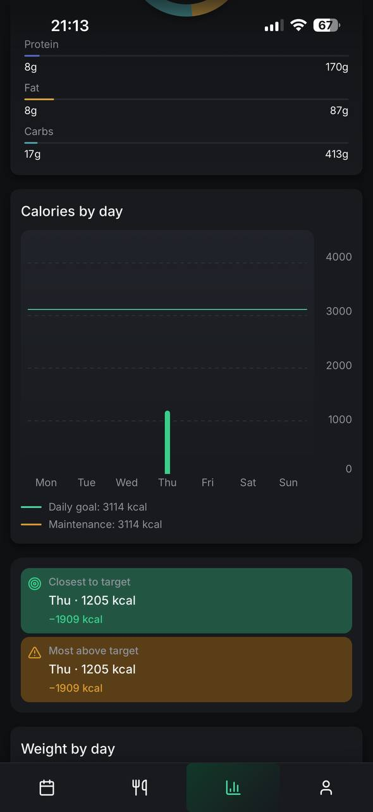
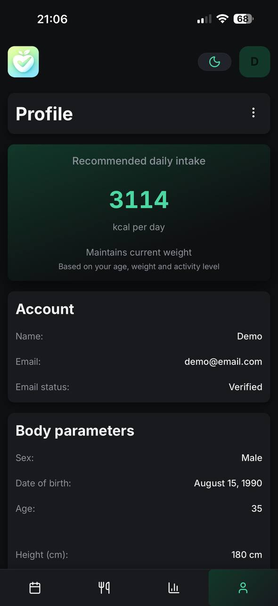

<p align="center">
  
</p>

<h1 align="center">🍏 Intake</h1>

<p align="center">
  <strong>Track food, not numbers.</strong><br/>
  Minimal AI‑powered food diary.
</p>

<p align="center">
  Describe what you ate — Intake calculates calories and macros automatically.
</p>

<p align="center">
  
  
  
  
  
</p>

---

# 🌐 Live Demo

https://intake-web-pi.vercel.app/

### Demo account

```
email: demo@email.com
password: demo123456
```

---

# 📱 Screens

### Landing



### Dashboard




### Day




### Food entries



### Statistics




### Profile



---

# 📌 Overview

**Intake** is a minimalist **AI‑powered food diary**.

Instead of manually tracking calories, the user simply describes what they ate.

Example:

```
Chicken breast 200g with rice
```

The system uses AI to:

- detect food items
- estimate portion size
- calculate calories
- calculate macros (protein, fat, carbs)

All data is stored **per day** and visualized in a **calendar‑based interface**.

The main idea is simple:

> _You describe — the system calculates — you see the result._

---

# ✨ Main Features

- User authentication (register, login, password reset)
- AI food logging (text + voice input)
- Calendar‑based daily diary
- Automatic calorie & macro calculation
- Daily nutrition overview
- Weekly and monthly statistics
- Weight tracking
- Installable **PWA**

---

# 🧱 Frontend Architecture

The frontend follows **Feature‑Sliced Design (FSD)**.

```
src
 ├ app
 ├ pages
 ├ widgets
 ├ features
 ├ entities
 └ shared
```

**React Query** handles server state.  
**Zustand** handles UI state.

All nutrition calculations are performed on the **backend**.

---

# 🧰 Tech Stack

### Frontend

- React 19
- TypeScript (strict)
- TanStack React Query
- TanStack Router
- React Hook Form + Zod
- Zustand
- Vanilla Extract
- Framer Motion

### Infrastructure

- Vite
- Axios
- i18next
- PWA (vite-plugin-pwa)

---

# 🚀 Run locally

```bash
npm install
npm run dev
```

Set API URL in `.env`:

```
VITE_API_URL=http://localhost:3000
```

---

# 🔗 Related

Backend API:

https://github.com/bohdan-strilets/Intake-api

---

# ✍️ Author

**Bohdan Strilets**

Portfolio project — _Intake_
